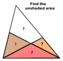

# Triangle Puzzle

Here is a hard geometry puzzle my son brought home from school. He told me it came from a 1940s 11+ exam and could be solved with geometry.

I was unable to solve it with geometry so I solved it with Cartesian co-ordinates (a very bad method) - see the [Jupyter Notebook](triangle_puzzle.ipynb) for my solution.

Nick Craig-Wood
2024-10-17
